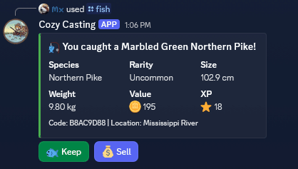
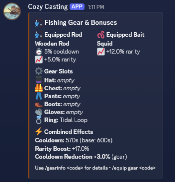
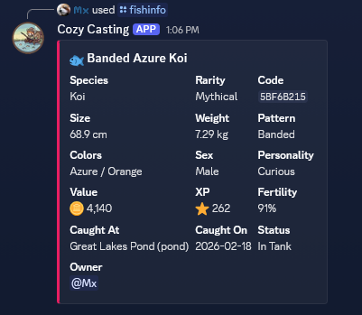
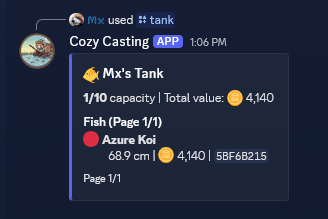
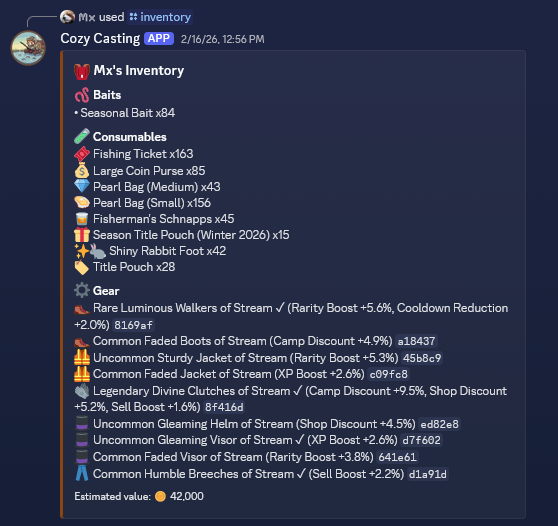
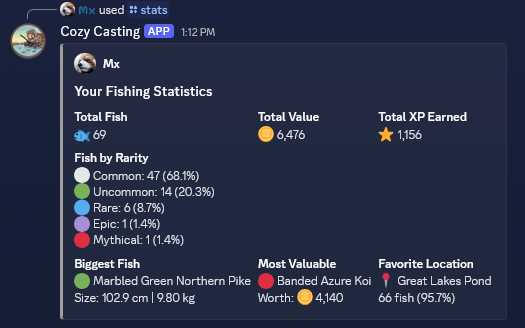
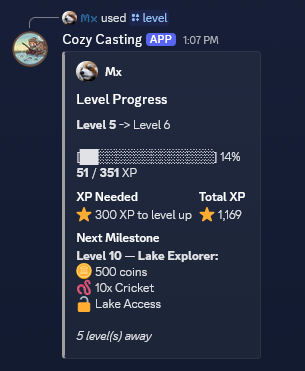
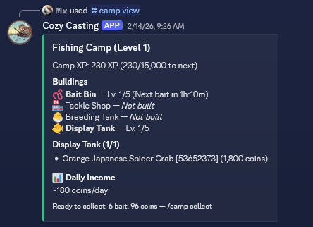

# Screenshots

Get a sneak peek at what CozyCasting looks like in action. All screenshots are taken from real gameplay during Alpha testing.

---

## 🎣 Fishing

<figure markdown>
  
  <figcaption>Catch a fish — every catch shows rarity, size, value, and XP earned</figcaption>
</figure>

<figure markdown>
  
  <figcaption>Gear stats — view your equipped rod, bait, and all active fishing bonuses</figcaption>
</figure>

---

## 🐟 Fish & Collection

<figure markdown>
  
  <figcaption>Fish info — detailed species page with rarity, habitat, base value, and lore</figcaption>
</figure>

<figure markdown>
  
  <figcaption>Your tank — browse your personal aquarium and see your collection's total value</figcaption>
</figure>

---

## 📦 Inventory & Economy

<figure markdown>
  
  <figcaption>Inventory — manage your rods, bait, gear, consumables, and chests</figcaption>
</figure>

---

## 📈 Progression

<figure markdown>
  
  <figcaption>Level progress — track your XP, see upcoming rewards and milestones</figcaption>
</figure>

<figure markdown>
  
  <figcaption>Stats — total fish caught, value earned, rarity breakdown, and XP history</figcaption>
</figure>

---

## 🏕️ Camp

<figure markdown>
  
  <figcaption>Fishing Camp — upgrade your camp to unlock new buildings and perks</figcaption>
</figure>

---

!!! tip "Want to see more?"
    Join the Alpha and start playing — screenshots don't do it justice. Use `/fish` to get started!
